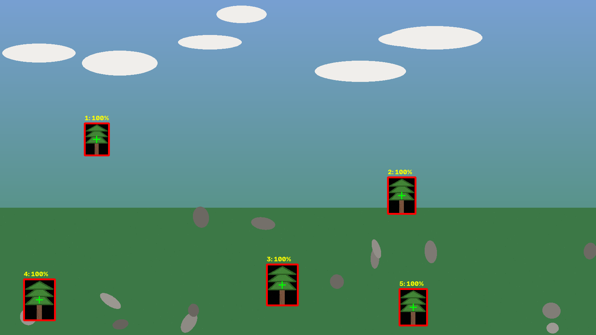

# 🌳 بات قطع درخت (Tree Auto-Clicker)

هر ۵ ثانیه صفحه رو نگاه می‌کنه، درخت‌ها رو با **تشخیص تصویر** پیدا می‌کنه و روشون
**کلیک** می‌کنه. دو نسخه داره:

| نسخه | برای چی | فایل |
|---|---|---|
| 🌐 **مرورگری (Tampermonkey)** | بازی‌های داخل مرورگر (کانواس/HTML5) | `web/tree-auto-clicker.user.js` |
| 🖥 **دسکتاپ (پایتون)** | هر بازی‌ای روی ویندوز — چون **کلیکِ واقعیِ ماوس** می‌زنه | `desktop/tree_auto_clicker.py` |

> ⚠️ کلیک باید روی **دستگاه خودت** انجام بشه. این کد فقط ابزارشه؛ ربات جایی به
> حساب بازی تو وصل نمی‌شه و هیچ‌چی رو هک نمی‌کنه — دقیقاً همون کاری رو می‌کنه که
> خودت با ماوس می‌کردی، فقط هر ۵ ثانیه و بدون خستگی.

---

# 🌐 نسخه‌ی مرورگری (سریع‌ترین راه)

### نصب در ۴ قدم

1. افزونه‌ی **Tampermonkey** رو نصب کن:
   - کروم: [Chrome Web Store](https://chromewebstore.google.com/detail/tampermonkey/dhdgffkkebhmkfjojejmpbldmpobfkfo)
   - فایرفاکس: [Firefox Add-ons](https://addons.mozilla.org/firefox/addon/tampermonkey/)
2. فایل `web/tree-auto-clicker.user.js` رو باز کن → روی **Install** بزن.
   (یا داخل Tampermonkey → `+` → محتوای فایل رو پیست کن → Save)
3. بازی رو باز کن. بالا-چپ صفحه یه پنل **🌳 بات قطع درخت** ظاهر می‌شه.
4. توی پنل:
   - **🎯 انتخاب درخت** رو بزن → با ماوس دور یه درختِ کامل مستطیل بکش
     (همون لحظه از بازی عکس گرفته می‌شه و اون تیکه می‌شه «قالب»).
   - **🧪 تست** رو بزن تا ببینی درخت‌ها رو درست پیدا می‌کنه یا نه — کادرهای
     سبز با درصد شباهت روی صفحه کشیده می‌شن، **بدون هیچ کلیکی**.
   - اگه کادرها درست بودن، **▶ شروع** رو بزن. تمام؛ از این به بعد هر ۵ ثانیه
     خودش همه‌ی درخت‌ها رو کلیک می‌کنه.

### پنل چه امکاناتی داره

| بخش | توضیح |
|---|---|
| فاصله (ثانیه) | هر چند ثانیه یه دور — پیش‌فرض **۵** |
| آستانه شباهت | از ۰.۳ تا ۰.۹۹ — پیش‌فرض **۰.۸** (بالاتر = سخت‌گیرتر) |
| مقیاس‌ها (از/تا) | اگه درخت‌ها تو بازی کوچیک/بزرگ می‌شن، این بازه رو تنظیم کن |
| لرزش ماوس | یه ذره تصادفی بودنِ نقطه‌ی کلیک (کمتر شبیه ربات) |
| کلیک روی هر درخت | اگه یه ضربه درخت رو نمی‌ندازه، بذار ۲ یا ۳ |
| حالت کلیک | **ماوس** / **لمس (موبایلی)** / **هر دو** — اگه بازی کلیک جاوااسکریپتی رو قبول نکرد عوضش کن |
| هدف کلیک | «عنصر زیر ماوس» یا «کانواس بازی» یا هر دو |
| محدوده | بی‌خودی کل صفحه دنبال درخت نگرده؛ فقط این ناحیه رو بگرد |
| کادرها رو نشون بده | نمایش تشخیص‌ها روی صفحه |
| میان‌برها | **F8** توقف/ادامه • **F9** خروج |

تنظیمات و قالب در `localStorage` ذخیره می‌شن؛ دفعه‌ی بعد بازی رو باز کنی، قالبت هست.

### مزیت‌ها/محدودیت‌ها
- ✅ سریع، بدون نصب پایتون، تنظیمات زنده، تستِ بدون کلیک.
- ⚠️ اگه بازی کانواس رو cross-origin لود کرده باشه، خوندن پیکسل‌ها ممکن نیست
  (پنل خودش خطا رو نشون می‌ده).
- ⚠️ بعضی بازی‌ها کلیک جاوااسکریپتی رو قبول نمی‌کنن → از نسخه‌ی دسکتاپ استفاده کن.

---

# 🖥 نسخه‌ی دسکتاپ (ویندوز) — دقیق‌ترین

اینا **کلیک واقعیِ ویندوز** می‌زنن (با `pyautogui`)، پس هر بازی‌ای که با ماوس
کار می‌کنه رو پشتیبانی می‌کنه — حتی اگه رویدادهای تقلبیِ جاوااسکریپت رو رد کنه.

### نصب

1. **Python** رو از [python.org/downloads](https://www.python.org/downloads/) نصب کن
   (توی نصب، تیک **Add python.exe to PATH** رو بزن).
2. توی پوشه‌ی `desktop`، فایل **`setup_windows.bat`** رو دوبار کلیک کن.
   (یا دستی: `pip install pyautogui mss opencv-python pillow pynput`)

### اجرا

```bat
:: ۱) اول قالب درخت رو انتخاب کن (با ماوس مستطیل بکش) و بعد شروع می‌کنه:
run_windows.bat

:: یا دستی:
python tree_auto_clicker.py --pick --interval 5

:: ۲) تستِ بدون کلیک (همیشه اول این رو بزن):
python tree_auto_clicker.py --template tree.png --dry-run --once
::    → یه عکس debug/found.png می‌سازه که درخت‌های پیدا‌شده توش کادر شدن

:: ۳) اجرای واقعی با قالبِ ذخیره‌شده:
python tree_auto_clicker.py --template tree.png --interval 5
```

- **F8** = توقف/ادامه • **F9** = خروج (سراسری‌ان، حتی وقتی پنجره‌ی بازیه)
- میان‌برهای اضطراری pyautogui: ماوس رو ببر **گوشه‌ی بالا-چپ صفحه** → همه‌چیز متوقف می‌شه.
- هر کلیک توی `clicks.jsonl` ثبت می‌شه.

### گزینه‌های مهم

```
--interval 5            هر ۵ ثانیه یه دور (پیش‌فرض)
--threshold 0.78        آستانه‌ی شباهت؛ کمتر = حساس‌تر
--scales 0.9:1.15:0.125 اگه سایز درخت‌ها تو بازی فرق می‌کنه
--gray                  تطبیق سیاه‌وسفید (وقتی رنگ بازی مدام عوض می‌شه)
--region x,y,w,h        فقط این ناحیه از صفحه اسکن شه
--clicks-per-tree 2     دو کلیک روی هر درخت
--jitter 3              لرزش تصادفی نقطه‌ی کلیک
--max-trees 5           بیشتر از ۵ درخت در هر دور کلیک نکن
--shoot shot.png        یه اسکرین‌شات بگیر و ذخیره کن (بعد برو)
--config my.json        تنظیمات از فایل
```

### گرفتن اسکرین‌شات بدون پنجره (Win+Shift+S)
اگه `--pick` کار نکرد: با `Win+Shift+S` دور یه درخت مستطیل بکش، عکس رو
کنار اسکریپت به اسم `tree.png` ذخیره کن، بعد `--template tree.png`.

---

# 🧠 چطور کار می‌کنه؟ (تشخیص تصویر)

1. **گرفتن فریم**: از کانواس (مرورگر) یا کل صفحه (دسکتاپ) یه عکس گرفته می‌شه.
2. **خاکستری‌سازی** و ساختن «هرم» سه‌سطحی:
   - **درشت** (ابعاد کوچک): کل صفحه ارزان اسکن می‌شه تا کاندیدها پیدا شن
   - **نیم‌اندازه**: جای دقیق‌تر، با تحملِ خطاهای یک‌پیکسلیِ مقیاس‌دهیِ بازی
   - **تمام‌اندازه**: تصمیمِ نهایی با وضوح کامل
3. **NCC** (همبستگی متقابلِ نرمال‌شده): میزان شباهتِ قالبِ درخت با هر نقطه‌ی صفحه.
   نرمال‌شده یعنی نسبت به روشنایی/کنتراست هم مقاومه.
4. **NCC مقاوم**: اگه یه سنگ یا بوته داخل کادرِ قالبِ تو افتاده باشه، تشخیص
   خراب می‌شه (امتحان کردیم: نمره از ۱ می‌افته به ۰.۴!). برای همین پیکسل‌های
   پرت شناسایی و کنار گذاشته می‌شن و بعد از اون شباهت حساب می‌شه.
   + یه «گاردِ ساختار» هم هست که جلوِ تشخیص‌های الکی (چمنِ خالی شبیه چمنِ خالی)
   رو می‌گیره.
5. **NMS**: اگه یه درخت چند بار شناسایی بشه، فقط بهترین باکس می‌مونه.
6. **کلیک**: ماوس روی مرکزِ هر باکس + یه لرزش کوچیک، با تأخیرِ کوتاه بین درخت‌ها.

### نمونه‌ی خروجی (تشخیص روی یه صحنه‌ی آزمایشی)



کادرهای قرمز = درخت‌های پیدا‌شده با درصد شباهت. سنگ‌ها و ابرها اشتباه گرفته نشدن.

### نتایج تست‌های خودکار
- دسکتاپ: `desktop/selftest.py` → **۲۱ از ۲۱ تست پاس** (تشخیص + اجرای کامل ربات بدون کلیک)
- مرورگر: `web/test/matcher.test.js` → **۲۰ از ۲۰ تست پاس**
  (صحنه‌ی مصنوعی با ۵ درخت در سه سایز، بدون تشخیص اشتباه، ~۱۰۰ms در هر دور)

اجرای تست‌ها:
```bash
cd desktop && python selftest.py
cd web && node test/matcher.test.js
```

---

# 🔧 اگه درخت‌ها رو پیدا نکرد

| مشکل | راه‌حل |
|---|---|
| کادرها دیر یا اشتباه | **آستانه شباهت** رو کم کن (۰.۷ یا ۰.۶۵) |
| روی چیزای اشتباه کلیک می‌کنه | آستانه رو **ببر بالا** (۰.۸۵–۰.۹) |
| درخت‌ها کوچیک و بزرگ می‌شن | بازه‌ی **مقیاس‌ها** رو باز کن: `--scales 0.7:1.4:0.05` |
| بازی کلیک رو قبول نمی‌کنه | «حالت کلیک» → لمس / هر دو، یا برو سراغ نسخه‌ی دسکتاپ |
| رنگ صفحه مدام عوض می‌شه | `--gray` (دسکتاپ) یا «تست» رو با قالب دیگه تکرار کن |
| خیلی کند/سنگین | فاصله رو بیشتر کن (مثلاً ۱۰ ثانیه) یا «محدوده» رو محدود کن |
| اصلاً کانواس پیدا نمی‌کنه | بازی رو توی iframe باز کرده یا کانواس مخفیه — نسخه‌ی دسکتاپ رو بگیر |

**نکته‌ی مهم برای قالب‌گیری:** کادر رو **دقیق دور خودِ درخت** بکش و سعی کن
سنگ/بوته/دیوار داخلش نباشه. هرچی قالب تمیزتر، تشخیص بهتر (البته موتور «مقاوم»
تا حدی این حالت رو هم پوشش می‌ده).

---

# 📜 استفاده‌ی مسئولانه

- این ابزار برای بازی‌های تک‌نفره/شخصی ساخته شده. **قوانینِ بازی** رو رعایت کن؛
  بعضی بازی‌ها استفاده از ابزار خودکار رو ممنوع می‌کنن و امکان بن داره.
- از فاصله‌ی معقول (۵ ثانیه یا بیشتر) استفاده کن و لرزش و تأخیر تصادفی رو روشن بذار.
- هیچ داده‌ای جایی فرستاده نمی‌شه؛ همه‌چیز محلی و روی دستگاه خودته
  (تنظیمات در `localStorage`، لاگ‌ها در `clicks.jsonl`).

---

# 📁 ساختار پروژه

```
tree-bot/
├── README.md                      ← همین راهنما
├── web/
│   ├── tree-auto-clicker.user.js   ← اوسراسکریپت (کتابخانه‌ی تشخیص + پنل فارسی)
│   ├── test/matcher.test.js        ← ۲۰ تست خودکار موتور تشخیص (Node)
│   └── debug/                      ← خروجی تست‌ها (تصویر صحنه، نتیجه)
└── desktop/
    ├── tree_auto_clicker.py        ← ربات اصلی (کلیک واقعیِ ویندوز)
    ├── matcher.py                  ← موتور تشخیص (OpenCV)
    ├── selftest.py                 ← ۲۱ تست خودکار
    ├── setup_windows.bat           ← نصب پیش‌نیازها (ویندوز)
    ├── run_windows.bat             ← اجرا با یه کلیک (ویندوز)
    └── debug/                      ← عکس‌های تست و کادرها
```

---

ساخته‌شده برای «قطع درخت»؛ اگه چیزی درست کار نکرد، یه **اسکرین‌شات از بازی**
بفرست تا آستانه و مقیاس‌ها رو برات تنظیم کنم. 🌳🪓
